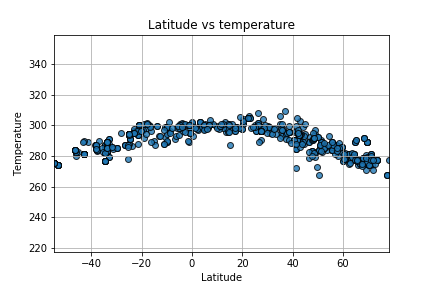

## Weather Py

WeatherPy Problem Statement

In this example, you'll be creating a Python script to visualize the weather of 500+ cities across the world of varying distance from the equator. To accomplish this, you'll be utilizing a [simple Python library](https://pypi.python.org/pypi/citipy), the [OpenWeatherMap API](https://openweathermap.org/api), and a little common sense to create a representative model of weather across world cities.

Your objective is to build a series of scatter plots to showcase the following relationships:

* Temperature (F) vs. Latitude
* Humidity (%) vs. Latitude
* Cloudiness (%) vs. Latitude
* Wind Speed (mph) vs. Latitude

#### Analysis
#### As we go closer to Equator(lat=0) temperature rises and highest
#### temp  is recorded between 0-20 degree lat

#### Analysis
#### As we go closer to Equator(lat=0) Humidity rises and high
#### humidity  is recorded between 0-+20 degree lat
#### However there is no clear relationship

#### There is no direct coorelation between cloudiness and Lat.

#### There is no coorelation between Lat and windspeed

